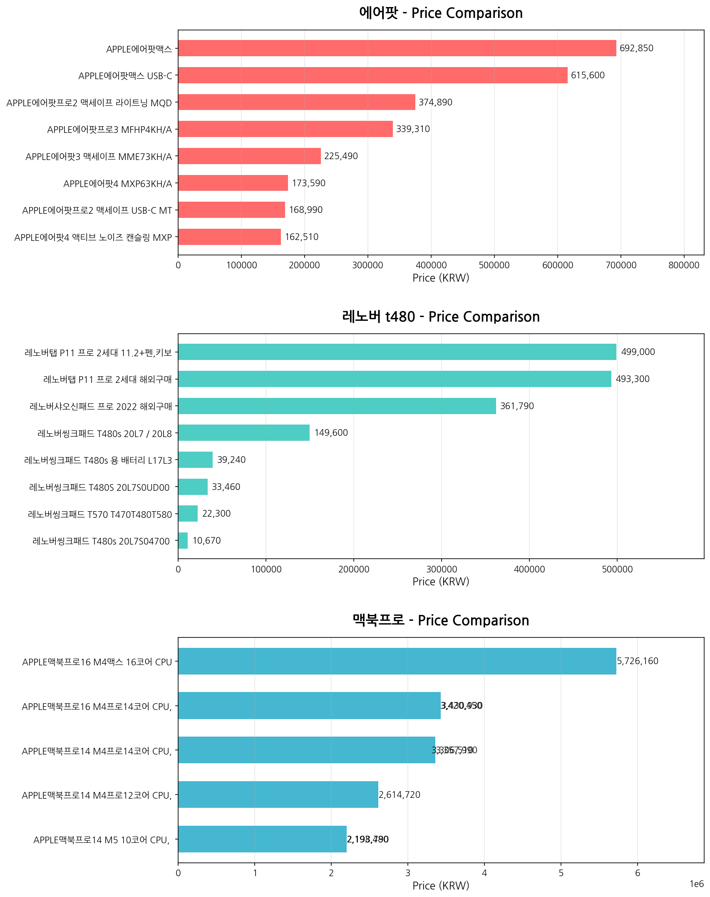
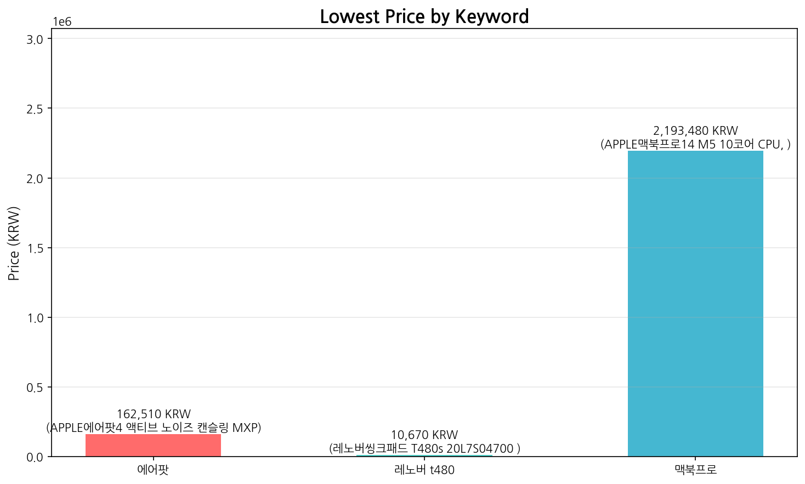

# 🛒 Danawa Price Monitor

A web scraping tool that automatically collects product prices from [Danawa](https://www.danawa.com) (Korea's largest price comparison site) and generates visual price comparison reports.

## What it does

- Scrapes product listings across multiple search keywords simultaneously
- Extracts product names and prices from search results
- Exports structured data to CSV
- Generates price comparison charts automatically

## Tech Stack

- **Python 3.12**
- **Playwright** — headless browser automation
- **BeautifulSoup4** — HTML parsing
- **Matplotlib** — data visualization

## Getting Started
```bash
# Install dependencies
pip install playwright beautifulsoup4 matplotlib
playwright install chromium
playwright install-deps

# Run the scraper (comma-separated keywords)
python scraper.py 에어팟, 갤럭시버즈, 소니 이어폰

# Generate charts
python visualize.py
```

## Sample Output

### Terminal
```
📋 Keywords: ['에어팟', '갤럭시버즈', '소니 이어폰']

🔍 Searching '에어팟'...
   → 8 products collected
🔍 Searching '갤럭시버즈'...
   → 8 products collected
🔍 Searching '소니 이어폰'...
   → 8 products collected

📦 Total: 24 products collected
```

### Price Comparison by Keyword


### Lowest Price Comparison


### CSV Export

| Keyword | Product | Price (KRW) | Date |
|---------|---------|-------------|------|
| 에어팟 | APPLE AirPods Pro 3 MFHP4KH/A | 339,310 | 2026-02-07 |
| 갤럭시버즈 | Samsung Galaxy Buds3 Pro SM-R630N | 191,090 | 2026-02-07 |
| 소니 이어폰 | SONY MDR-E9LP | 6,300 | 2026-02-07 |

## Project Structure
```
danawa-price-monitor/
├── README.md           # Documentation
├── scraper.py          # Main scraper
├── visualize.py        # Chart generation
├── data/               # Collected data (CSV)
└── screenshots/        # Generated charts
```

## Use Cases

- **E-commerce sellers** — monitor competitor pricing in real time
- **Bargain hunters** — track price drops across multiple products
- **Market researchers** — analyze pricing trends across categories

## How it Works

1. Launches a headless Chromium browser via Playwright
2. Navigates to Danawa search results for each keyword
3. Parses product names and prices from the DOM
4. Saves structured data to timestamped CSV files
5. Generates horizontal bar charts comparing prices across keywords

## License

MIT
